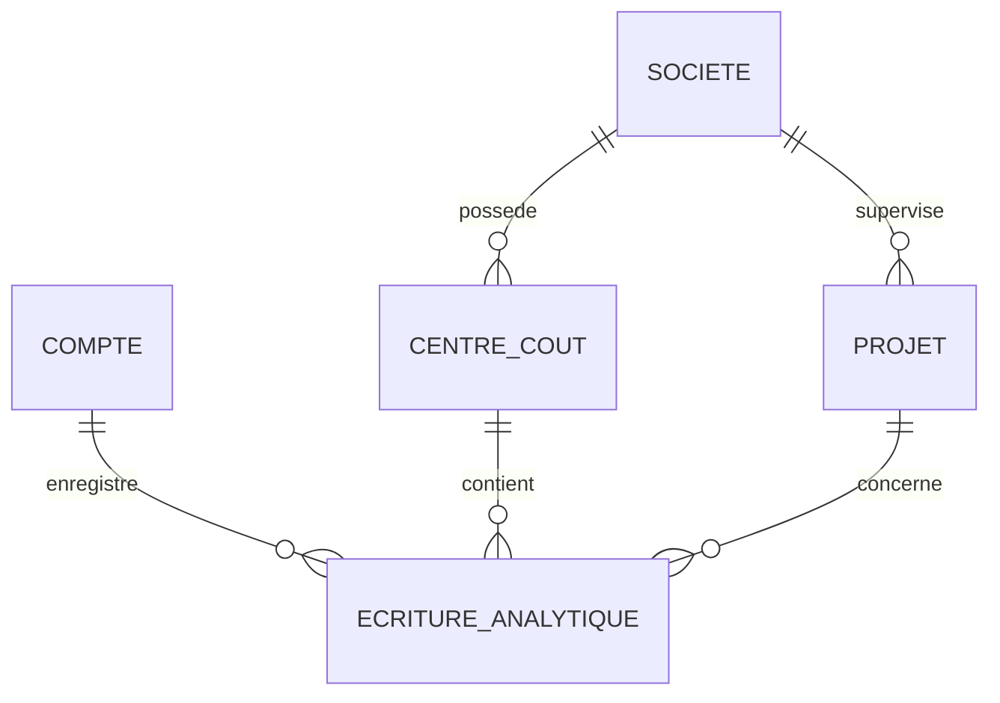
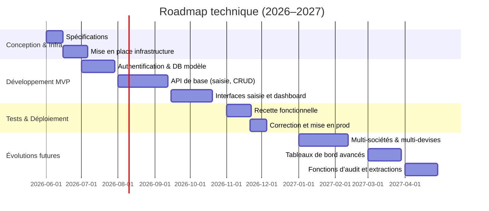
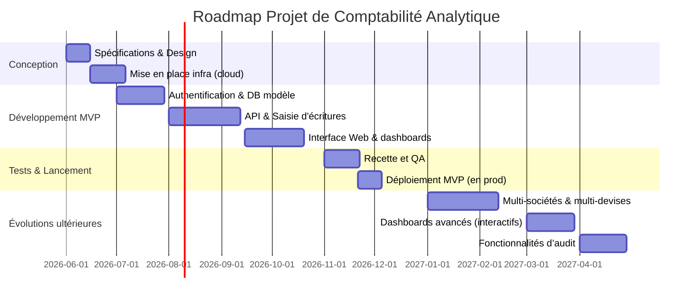

# Rapport de projet : application de comptabilité analytique

## Résumé exécutif

Ce rapport présente une analyse complète pour la conception d’une application de **comptabilité analytique** d’entreprise, en couvrant les exigences fonctionnelles et techniques, les options technologiques et les recommandations de mise en œuvre. On y détaille les besoins métier (sécurité, conformité, multi-sociétés, etc.), les choix de stack backend et frontend (langages, frameworks, architectures), les bases de données (OLTP vs OLAP, schémas), les outils de calculs analytiques (ETL, streaming), ainsi que les aspects **sécurité**, **conformité** (RGPD, normes fiscales), authentification/autorisation, déploiement (cloud vs on-premise, conteneurs, CI/CD, observabilité, sauvegardes) et le coût/complexité pour différents scénarios (start-up, PME, grande entreprise). Un *MVP minimal* et une roadmap sont proposés avec un échéancier, suivis d’une analyse des risques et de leurs atténuations. Enfin, trois exemples de stacks complètes adaptées aux contextes d’équipe (de 1 à 5 devs, 5–20, >20 devs) sont suggérés, avec comparatifs synthétiques.

Les exigences critiques sont notamment : gestion multi-sociétés et multi-devises, performance des calculs analytiques et reporting, auditabilité des écritures (pistes d’audit immuables), haute disponibilité et sauvegarde. Pour y répondre, on préconise une architecture modulaire (microservices conteneurisés), API sécurisées, bases OLTP (PostgreSQL/MySQL) couplées à un entrepôt de données OLAP ou à une base colonnes (ClickHouse, Snowflake) pour accélérer les requêtes analytiques【44†L335-L344】【44†L347-L354】. Le front-end s’appuiera sur un framework JS moderne (React ou Angular) et des librairies de visualisation (Chart.js, D3.js) adaptées aux tableaux de bord analytiques【36†L85-L94】【36†L98-L106】. Les calculs complexes pourront utiliser des moteurs dédiés (Apache Spark, Pandas, ou SQL dans la base colonnes) et un planificateur de tâches (Airflow/Cron) pour le batch, éventuellement complété par Kafka/Flink pour un traitement en *streaming* temps réel【31†L242-L251】【31†L216-L224】. 

La conformité inclut notamment le respect du FEC, des liasses fiscales et de la facturation électronique obligatoires (réforme 2026 en France)【3†L378-L383】【16†L647-L652】, ainsi que le RGPD. On adoptera OAuth2/OpenID Connect et RBAC pour l’accès, et chiffrement des données en transit et au repos. L’infrastructure ciblera le cloud (AWS, GCP, Azure) pour l’élasticité, avec orchestrateur Kubernetes, CI/CD automatisé, et monitoring (Prometheus, ELK, etc.) pour garantir disponibilité et montée en charge. Les coûts estimatifs vont de quelques dizaines de milliers d’euros pour un prototype minimal (startup, 1–5 devs) à des centaines de milliers voire plus pour une solution d’entreprise (20+ devs)【51†L171-L180】【51†L203-L212】.  

Une roadmap technique propose un MVP focalisé sur la saisie des écritures analytiques, la répartition par centre de coûts/projets et quelques rapports clés, suivie d’itérations pour multi-sociétés, multi-devises et compléments. Des diagrammes explicatifs (architecture système, planning Gantt, ER simplifié) illustrent la solution. Des tableaux comparatifs résument le choix des technologies backend, frontend, bases de données et stacks complètes. 

## 1. Exigences fonctionnelles et non-fonctionnelles

### Exigences fonctionnelles typiques
- **Ventilation analytique** : gérer les écritures comptables avec ventilation automatique par axes analytiques (projet, centre de coût, BU, etc.), dès la saisie ou en clôture, afin de fournir en temps réel des états segmentés (par produit, site, etc.)【10†L438-L447】. L’application doit permettre les imputations manuelles et la définition de règles d’allocation (p.ex. répartir les frais généraux selon un pourcentage ou clé définie).
- **Multi-sociétés** : support des entités multiples dans un groupe, avec consolidation éventuelle. Par exemple, des écritures inter-sociétés doivent pouvoir être filtrées et éliminées à la consolidation【16†L675-L678】.
- **Multi-devises** : enregistrement et conversion automatique des montants dans différentes monnaies. Le système doit gérer plusieurs devises, taux de change (spot, achat/vente, fixes ou variables), réévaluations monétaires, ainsi que les écritures de gains/pertes de change. Cela permet de *« gérer les besoins en matière de conformité comptable »* et de produire des rapports multi-devises【7†L389-L392】.
- **Intégration** : import/export (API, fichiers) avec la comptabilité générale et d’autres systèmes (ERP existant, logiciels de paie, achats, etc.). Par exemple, l’interface avec le grand livre général doit permettre de synchroniser les écritures sans ressaisie.
- **Rapports et tableaux de bord** : édition de tableaux de bord financiers interactifs (graphiques dynamiques) et d’états (balance analytique, comparaison budget/réel, indicateurs de performance). La conception UX des dashboards doit suivre les meilleures pratiques (clarté visuelle, hiérarchie de l’information) pour faciliter la lecture【38†L60-L68】【38†L73-L82】.
- **Audit et traçabilité** : chaque saisie ou modification doit être horodatée et attribuée à un utilisateur, avec conservation immuable (pistes d’audit). Par exemple, un ERP centralisé *« facilite le suivi des opérations, l’auditabilité des comptes »* et assure la continuité des données, même en multi-sites【16†L640-L643】. Les écritures doivent être historisées (FEC en France, voire journaux électroniques).
- **Budget et prévisions** : prise en charge éventuelle de plans budgétaires, comparaison aux réalisations, calculs des écarts et alertes sur dépassement.
- **Archivage** : gestion des données historiques (archives annuelles) avec possibilité de consultation sécurisée et fiable.

### Exigences non-fonctionnelles
- **Performance et montée en charge** : le système doit supporter le traitement de gros volumes d’écritures (millions de lignes) et des requêtes analytiques complexes (agrégations, simulations). On dimensionnera l’architecture pour assurer des temps de réponse acceptables (souvent < quelques secondes) même en pointe. Les bases de données et moteurs de calcul (SQL optimisé, base colonne) sont choisis pour cela【44†L342-L347】【44†L398-L407】. Des stratégies de mise en cache et de traitement asynchrone ou par lot peuvent être nécessaires pour les calculs lourds (p.ex. répartition générale mensuelle en batch la nuit).
- **Scalabilité** : la solution doit évoluer horizontalement (plus de serveurs) ou verticalement (plus de ressources) selon la croissance du volume et du nombre d’utilisateurs. Par exemple, un système microservices conteneurisé autorise l’ajout de nœuds pour absorber la charge. Le système d’ERP doit *« accompagner la montée en charge »* en ajoutant modules ou instances, sans interruption【16†L675-L678】.
- **Disponibilité et haute-disponibilité** : pour un usage critique (ex : clôtures mensuelles), l’application doit viser une disponibilité élevée (ex. SLA 99,9%). Cela implique répartition de charge, redondance (multirégions ou multi-AZ), et procédures automatiques de basculement. Les sauvegardes régulières sont indispensables pour restauration rapide en cas de panne. La stratégie de backup (journalière, incrémentale) et de restauration (tests périodiques) doit être définie (sur BD et fichiers) pour limiter les pertes de données.
- **Sécurité** : chiffrement des données en transit (TLS/HTTPS) et au repos, gestion stricte des permissions, protection contre les attaques (OWASP Top10) et des injections. Par exemple, chiffrement AES des données sensibles en base et communication HTTPS. Utilisation de solutions éprouvées (firewall applicatif, WAF, etc.) et d’une IAM robuste (OAuth2/OIDC, RBAC) pour l’authentification/autorisation.
- **Conformité fiscale et réglementaire** : le système doit respecter les normes en vigueur (plan comptable local, IFRS éventuelles, FEC français, etc.) et être capable d’évoluer rapidement lors de changements de réglementation. Par exemple, la réforme de la facturation électronique 2026 impose de *« produire des déclarations fiables »* et de se connecter à une plateforme agréée【10†L493-L502】. L’ERP doit intégrer les mises à jour automatiques de taux de TVA, des formats de liasse fiscale et du FEC【10†L536-L545】 pour garantir une conformité permanente.
- **Sécurité fonctionnelle (audit)** : journalisation complète des actions (logs d’accès et actions métier) pour vérification (ex. logs centralisés ELK). Garantie de non-répudiation des écritures comptables (tables historiques non modifiables).
- **Extensibilité et maintenabilité** : l’architecture choisie doit être modulaire et documentée, facilitant l’ajout de nouvelles fonctionnalités (p.ex. règles de calcul supplémentaires, modules sectoriels). L’utilisation de conteneurs et de CI/CD standard réduit le temps de mise à jour et d’intégration continue des correctifs/sécurités.

## 2. Options backend et architecture

### Langages et frameworks serveur
- **Java / Spring Boot (ou Jakarta EE)** : robuste pour les gros projets, mature et largement utilisé en finance. Offre un riche écosystème (Spring Security, Spring Data, etc.) adapté aux services monolithiques ou microservices. Performant, typé, avec gestion de threads. Convient aux architectures distribuées (microservices déployés en Docker/K8s). Inconvénient : temps de prise en main relativement long et lourdeur (surcharge de mémoire).
- **Python / Django ou Flask** : permet un prototypage rapide et des calculs analytiques aisés (bibliothèques pandas, NumPy). Django propose un ORM et de nombreux modules intégrés (auth, admin). Flask est plus minimaliste (on ajoute à la carte les extensions). Avantage : très productif, lisible. Inconvénient : moins performant en forte charge brute que Java, nécessité de choisir ou construire un schéma solide pour la montée en charge (par exemple répartir la charge via uWSGI/gunicorn).
- **Node.js / Express (ou NestJS)** : full JS stack, bonne scalabilité I/O, très adapté aux API REST/GraphQL. NestJS (un framework Node inspiré de Angular) ajoute de la structure pour les gros projets. Avantages : grand écosystème (npm), front-end et back-end en JS/TypeScript permet réutilisation de code. Inconvénient : vulnérabilité aux patterns callback/async si mal codé, et moins performant pour calculs CPU-intensifs (il faut déléguer aux microservices ou librairies C++ pour le calcul pur).
- **.NET Core / C#** : solide pour les applications d’entreprise, particulièrement si déjà d’autres systèmes Microsoft en place. Offre Entity Framework, Identity, etc. Performant sur Windows/Linux. Peut être utilisé en microservices. Inconvénient : dépendance .NET et licencing (pour SQL Server), moins courant en France hors grandes entreprises.
- **Autres** : Go ou Kotlin peuvent être envisagés pour la performance/simplicité, mais communauté plus restreinte. Ruby on Rails est peu utilisé pour les systèmes compta d’envergure. 

### Architecture monolithique vs microservices
- **Monolithe** : toutes les fonctionnalités (API REST, logique métier, accès DB) dans une seule application. Avantages : déploiement simple, bon pour POC ou petite équipe, cohérence transactionnelle. Inconvénients : évolutivité limitée, refactoring et maintenance difficiles au fur et à mesure que le code grossit【26†L53-L62】. Un bug dans un module peut affecter tout l’ensemble. Le scaling oblige à dupliquer toute l’application (tout ou rien) même si seule une partie est sollicitée【26†L149-L156】.
- **Microservices / architecture distribuée** : découper par domaine (ex. service « écritures analytiques », service « budgets », service « authentification », etc.). Chaque microservice a son propre cycle de vie, base de données et instances déployables indépendamment. Avantages : flexibilité, évolutivité fine (on scale seulement les services critiques), résilience isolée, réutilisation de la logique via API. Facilite l’adoption du *CI/CD* et permet de mélanger technologies (un service en Java, un autre en Python…). Inconvénients : plus complexe à concevoir (nécessite API cohérentes, gestion des transactions distribuées, monitoring fin, orchestration Kubernetes), overhead de communication (latence réseau).
  
Par ailleurs, l’approche « services » permet de mieux séparer OLTP et calcul analytique : par exemple, un microservice peut alimenter un data warehouse ou un moteur OLAP en continu (via CDC ou API) tandis qu’un autre gère la saisie transactionnelle. Cela reflète la séparation **OLTP vs OLAP** standard (voir section BD)【44†L335-L344】【44†L347-L354】.  

### API REST vs GraphQL vs autres
- **REST** : standard éprouvé, simple à mettre en œuvre avec Spring, Django REST, etc. Chaque ressource a son endpoint et on utilise les codes HTTP pour statuts. Avantages : concept simple, cache HTTP natif, large support (Swagger, OAS, Postman). Inconvénients : peut nécessiter plusieurs appels pour une opération complexe (sous- ou sur-récupération de données).
- **GraphQL** : un seul endpoint qui permet au client de spécifier exactement quelles données il souhaite. Avantages : très efficace pour minimiser le trafic (pas de sous/ sur-requête)【28†L115-L118】, flexibilité pour l’interface (p.ex. un front-end peut demander « compte + centre de coût + libellé » en une requête), versionnement plus fluide (pas besoin de créer de nouveaux endpoints quand on ajoute un champ). Inconvénient : nécessite la définition d’un schéma GraphQL, complexité d’implémentation initiale et de sécurisation (ex. contrôle fin sur les requêtes possibles). Utile quand on a de nombreux frontaux ou besoins ad hoc. Par exemple, on peut utiliser Apollo Server avec Node ou Graphene avec Django.
- **Autres** : gRPC (RPC via protobuf, efficace interne entre microservices), SOAP (plutôt legacy, à éviter pour du neuf), Thrift, etc. 

### Calculs batch vs temps réel
- **Batch (traitement par lots)** : adapté aux tâches récurrentes de grande envergure (clôture mensuelle, calcul des imputations globales, etc.)【30†L89-L98】【31†L242-L251】. On programme des jobs (p. ex. Airflow, Celery, cron) qui s’exécutent hors des heures de pointe pour exploiter pleinement la puissance serveur. Avantages : simplicité de mise en œuvre (p. ex. scripts Python ou SQL planifiés), pas de contrainte de latence. Idéal pour les calculs lourds (données accumulées) qui peuvent attendre (ex. consolidation mensuelle). Les données peuvent être ingérées puis traitées en masse.
- **Temps réel / streaming** : pour les tableaux de bord réactifs ou alerts (ex. signaler immédiatement un dépassement de budget). Utilisation de systèmes de streaming (Kafka, Pulsar) et de frameworks (Spark Streaming, Flink) pour traiter les données au vol【31†L216-L224】. Avantages : accès aux données « à la seconde », prise de décision instantanée. Inconvénients : plus complexe (gestion de la cohérence, tolérance aux pannes), coûteux en ressources. À réserver aux besoins urgents de fraîcheur des données (fraudes, KPI live)【31†L242-L251】. 

Dans la pratique, on combinera souvent les deux : la majorité des rapports lourds partent en batch la nuit, tandis que le front-end peut requêter régulièrement une couche analytique mise à jour en quasi-temps réel (via micro-batch ou streaming intégré).  

## 3. Options frontend et visualisation

### Frameworks JS et bibliothèques UI
- **React** (par Facebook) : bibliothèque très populaire pour les interfaces riches. Virtuel DOM performant, écosystème étendu (Next.js, Redux, MUI…). Convient aux tableaux de bord dynamiques. Grande communauté, nombreuses intégrations (Chart.js, Recharts). Inconvénient : nécessite assemblage (router, gestion d’état, etc.) via des packages tiers.
- **Angular** (par Google) : framework complet (opinionated, TypeScript) adapté aux grandes applications. Intègre tout le nécessaire (routing, formulaires, services). Avantages : structure stricte, testabilité, RxJS pour les flux de données. Bien utilisé en entreprises. Inconvénient : courbe d’apprentissage plus raide, plus verbeux pour des projets simples.
- **Vue.js** : framework progressif plus léger. Combine facilité d’usage (templates proche HTML) et performances. Avantage : bonne documentation, taille modeste, communauté croissante. Parfait pour startups ou MVP. Inconvénient : entreprise exigeant souvent Angular/React, moins de gros projets de niveau entreprise que React/Angular.
- **Autres** : Svelte (très léger, performant) ou bibliothèques légères (jQuery UI + ChartJS pour prototypes) peuvent être envisagées, mais moins répandues en projet critique. 

### Libs de visualisation / UI pour tableaux de bord
- **Chart.js** : open-source, simple à utiliser et léger (50 Ko). Propose ~8 types de graphiques (barres, lignes, camembert, nuage de points…)【36†L98-L106】. Rapide en rendu HTML5 Canvas【36†L138-L147】. Idéal pour des graphiques standards et statiques. Limité en personnalisation avancée (peu de types par défaut).
- **D3.js** : bibliothèque très puissante pour visualisation de données (SVG, transitions). Extrêmement flexible pour créer des graphiques sur mesure【36†L118-L127】, et bien supportée (nombreux plugins et exemples). Inconvénient : forte complexité de prise en main, nécessité de coder pour obtenir un résultat. Plus adaptée aux besoins spécifiques (infographie, évolutions dynamiques complexes) qu’aux camemberts/batons basiques.
- **ECharts (Apache)** : alternative open-source (par Baidu), riche en types de graphiques (cartes, mixte). Moderne, supports mobiles. Utilisé dans certains produits d’entreprise.
- **Highcharts/Highstock** : commercial, très complet (géo-cartes, séries temporelles, zoom avancé). Bon support et animations. Coût de licence à prévoir pour usage commercial.
- **Plotly / Dash** : Python/JS (plotly.js) pour graphiques interactifs, propose aussi un framework Dash. Utile pour prototypes analytiques.
  
Le choix dépend du besoin : pour un tableau de bord standard, Chart.js ou ECharts suffisent; pour des visualisations très sur-mesure ou hautement interactives, D3 ou Highcharts. On s’appuiera de plus sur des composants UI pour tableaux et formulaires (ex. Material UI, Ant Design, PrimeVue) afin d’avoir des saisies ergonomiques (grilles éditables, filtres, dialogues).

### UX et architecture de l’interface
Concevoir des écrans clairs et intuitifs est crucial. Les principes UX pour tableau de bord recommandent : 
- Hiérarchie claire des informations (les **KPI clés** en haut à gauche, détails secondaires plus bas)【38†L78-L86】【38†L88-L96】.
- Limiter le nombre d’indicateurs par écran (5–7 max) et permettre filtrages dynamiques【38†L73-L82】.
- Utiliser des conventions visuelles cohérentes (couleurs, typographies) et des graphiques adaptés (barres pour comparaisons, lignes pour tendances, etc.)【38†L73-L82】【38†L134-L142】.
- Favoriser l’accessibilité (contrastes suffisants, navigation clavier, compatibilité mobile si besoin)【38†L98-L107】.
- Offrir une navigation intuitive (menus clairs) et des vues “drill-down” pour explorer un indicateur.
  
Pour la saisie de données, on utilisera des composants de formulaire robustes avec contrôle de validité (react-hook-form, Formik, Angular Reactive Forms). L’interface devra gérer la saisie multi-devises et multi-companies (sélection de société, conversion automatique), et assurer une expérience utilisateur fluide (chargement progressif, pagination sur les listes lourdes).  

## 4. Bases de données et schémas de données

### Types de base et modélisation
- **Relationnelle OLTP (PostgreSQL, MySQL, SQL Server, Oracle)** : pour la comptabilité opérationnelle classique. Ces SGBD ACID sont recommandés pour stocker les écritures détaillées et les données de paramétrage (Chartes de comptes, centres de coûts, plans d’imputation, etc.). PostgreSQL est souvent privilégié pour son extensoibilité (unaccent, JSONB, types géo, etc.) et son coût libre. MySQL/MariaDB est une alternative connue. Inconvénient : en charges analytiques très lourdes (agrégations sur milliards de lignes), la performance peut devenir un frein.  
- **Entrepôt OLAP / Base colonnes (ClickHouse, Snowflake, Redshift, BigQuery)** : pour l’analyse et le reporting rapide sur gros volumes. Ces DB utilisent un stockage colonne et optimisations analytiques (index vectoriel, compression) permettant de scanner des milliards de lignes très vite【44†L398-L407】. Par exemple, ClickHouse peut traiter plus d’un milliard de lignes/seconde sur matériel standard【44†L398-L407】. Snowflake (cloud) ou Amazon Redshift offrent une solution managée élastique. Avantages : agrégations quasi-instantanées, stockage compressé. Inconvénients : coût (Snowflake est payant par requête/stockage), absence de transactions complexes (ClickHouse n’est pas ACID complet, par exemple) et nécessitent souvent une synchronisation régulière avec la base OLTP (via ETL ou CDC).  
- **Base de données “Time-Series”** (TimescaleDB sur PostgreSQL, InfluxDB) : si l’application doit historiser massivement des séries temporelles (ex. variations journalières ou en continu des KPI), ces BD optimisées pour séries temporelles sont envisageables. TimescaleDB (extension Postgres) permet de gérer de grandes quantités de données horodatées efficacement. InfluxDB et QuestDB sont d’autres options. Cependant, pour la comptabilité analytique, on se focalisera principalement sur OLTP et OLAP plutôt que sur des TSDB spécialisées. 
- **Data Warehouse** : s’inspirant de la méthodologie Kimball, on peut concevoir un schéma en étoile (fact table des écritures analytiques, dimensions comptes/centres/projets/temps/sociétés)【42†L335-L344】【44†L342-L347】. Par exemple, une *fact_comptes_analytiques* contiendrait les montants par compte analytique + clés étrangères vers les tables *dim_compte*, *dim_centre*, *dim_societe*, *dim_temps*, *dim_projet*. Ce modèle facilite les requêtes OLAP (slicing, drill-down, roll-up)【42†L335-L344】.  
- **Modélisation conseillée** : 
  - Table **Societe** (id, nom, devise, règles locales) ;  
  - Table **CentreDeCout** (id, code, nom, societe_id) ; Table **Projet** (id, code, nom, societe_id) ;  
  - Table **CompteAnalytique** (id, code, libellé, type, possibilité d’avoir un « parent » pour hiérarchie) ;  
  - Table **EcritureAnalytique** (id, date, compte_id, centre_cout_id, projet_id, montants (local et converti), devise, description, référence journal) ;  
  - (Optionnel) Table **RegleImputation** pour stocker les formules de répartition (p.ex. % fixe ou calcul basé sur attributs) ;  
  - Table **Utilisateur** (id, nom, rôle) reliée à chaque écriture pour traçabilité.  

Ci-dessus un schéma simplifié (diagramme ER) illustre les relations principales :  



Les stratégies de modélisation (3NF vs étoile) dépendront du SGBD. Sur PostgreSQL on peut rester relativement normalisé (3NF) pour l’OLTP, puis charger un schéma en étoile dans un DWH séparé pour les analyses. Sur ClickHouse ou Snowflake, on préfère généralement un schéma dénormalisé (étoile) pour profiter du stockage colonne et faciliter les requêtes analytiques【44†L342-L347】【42†L335-L344】.  

## 5. Outils pour calculs analytiques et transformations

- **ETL/ELT** : exécution de flux de données (Extraction-Transformation-Chargement) depuis diverses sources (comptabilité générale, achats, fichiers tiers) vers la base analytique. Des outils comme **Talend**, **Pentaho Data Integration**, **Apache Nifi** ou des scripts Python (pandas, sqlachemy) peuvent être utilisés. Les solutions managées (Stitch, Fivetran) automatisent la connexion aux sources. On peut effectuer les transformations via SQL (ELT) directement sur la base de données analytique, ou en Python/Scala pour des traitements plus complexes. On choisira par exemple Airbyte ou Talend pour un pipeline visuel, avec orchestration via Airflow.  
- **Moteurs de calcul** : 
  - *Batch* : Apache **Spark** ou **Dask** pour des traitements massifs distribués (utile si on se base sur un data lake) ;  
  - *SQL in-DB* : pour des besoins plus simples, confier au moteur SQL de la base analytique (ClickHouse, PostgreSQL avec extensions) le calcul des agrégations. Par exemple, ClickHouse prend en charge les vues matérialisées continues pour les pré-agrégations【44†L398-L407】.  
  - *BI/OLAP* : outils comme **Mondrian** ou services cloud OLAP (AWS Redshift Spectrum, Snowflake) peuvent servir de couche d’analyse.
- **Job schedulers / Orchestration** : pour automatiser les tâches ETL et traitements batch. Exemples : **Apache Airflow**, **Luigi**, **Cron**. Airflow permet de gérer les dépendances entre jobs (extraction -> transformation -> chargement), de réessayer en cas d’échec, et de surveiller l’historique.
- **Streaming** : pour la donnée temps réel ou quasi temps réel. **Apache Kafka** (bus de messages) avec connecteurs (Debezium pour CDC depuis BD, Kafka Connect), associé à **Spark Streaming** ou **Flink** pour traiter les flux en continu. Utile pour répercuter immédiatement les nouvelles écritures dans la couche analytique.  
- **Gestion des règles de répartition** : il n’existe pas d’outil unique standard. On peut développer un moteur de règles custom (ex. utiliser un moteur de règles générique comme Drools ou une simple table de formules SQL configurables). Les règles (taux de répartition, méthode d’allocation) doivent pouvoir être créées/modifiées par l’utilisateur (interface admin) et exécutées par lot (ex. calcul automatique des charges indirectes chaque mois).  

Dans l’ensemble, on privilégiera les solutions open-source éprouvées (Talend, Airflow, Spark) ou les services cloud gérés pour réduire la maintenance. L’**ELT** moderne peut s’appuyer sur dbt (data build tool) pour définir les transformations SQL dans Snowflake/BigQuery, en rajoutant une couche sémantique facile à maintenir【44†L438-L444】, bien que dbt soit anglophone.

## 6. Sécurité, conformité et authentification

- **Conformité (RGPD et normes)** : chiffrement des données sensibles, anonymisation/pseudonymisation là où nécessaire, droits d’accès restreints. Le traitement des données personnelles (ex. noms de clients/personnel) devra respecter les principes RGPD (licéité, minimisation, conservation limitée). Les logs d’accès devront indiquer qui a consulté quelles données. On inclura des fonctionnalités de consentement/résiliation si des données personnelles clients sont traitées. 
- **Normes locales non précisées** : le système est prévu pour être paramétrable aux spécificités locales (par ex. TVA spécifique par pays, obligations de reporting). En l’absence de norme précise, on implémente un cadre configurable (niveaux de tierces-déclarations, …) et documente les options.
- **Authentification/Autorisation** : on utilisera un protocole standard comme OAuth2/OpenID Connect (par ex. Keycloak, Auth0 ou Azure AD) pour gérer la connexion unique (SSO) et l’émission de tokens JWT. Le contrôle d’accès sera basé sur **RBAC** (Role-Based Access Control) : rôles (comptable, manager, admin…) avec permissions distinctes (lecture/écriture/approbation par module). Par exemple, seuls les cadres habilités pourront publier les écritures, tandis que les utilisateurs basiques ne font que la saisie.
- **Chiffrement** : 
  - *En transit* : HTTPS/TLS obligatoire pour toutes les communications (API, interface web).  
  - *Au repos* : les disques et bases de données (en particulier cloud) seront chiffrés (ex. EBS encrypt sur AWS, Transparent Data Encryption sur SQL Server/Oracle).  
  - Les mots de passe et clés seront stockés salés/bcrypt ou gérés par un vault (HashiCorp Vault, KMS).
- **Journalisation d’audit** : système de log avancé. Chaque opération critique (création/modification d’écriture, modification de paramètre, export de données) doit générer une entrée horodatée et liée à l’utilisateur. On utilisera un outil de centralisation (ELK Stack, Splunk) pour conserver longtemps les logs et faciliter les audits internes/externe. Les écritures comptables et leurs modifications ne seront jamais supprimées, mais marquées révoquées si besoin, pour respecter les obligations d’archivage fiscal (FEC). 

Toutes ces mesures garantissent que le système **sécurise les données financières sensibles** et reste conforme aux obligations légales et normes en vigueur (RGPD, audit bancaire si applicable, norme ISO/IEC 27001 pour la sécurité de l’information par exemple).

## 7. Déploiement et infrastructure

- **Cloud vs On-premise** : 
  - *Cloud* (AWS, Azure, GCP, ou hébergeur FR) est recommandé pour la flexibilité et la scalabilité. Il offre des services managés (DB, file storage, monitoring) qui simplifient la maintenance. Par exemple, on peut utiliser RDS/Aurora (PostgreSQL) et un service de datawarehouse (Snowflake ou Redshift) en mode hébergé, avec sauvegarde automatique multi-AZ. Les avantages : pas d’investissement matériel initial, élasticité à la demande, mises à jour de sécurité par le fournisseur.  
  - *On-premise* : en cas d’exigence réglementaire (ex. données ultra-sensibles devant rester dans les locaux) ou si l’entreprise dispose déjà d’un datacenter robuste. Cela implique plus de responsabilité IT (maintien des serveurs, firewall, réplication de données, backups). Les conteneurs et Kubernetes peuvent cependant être utilisés on-prem pour standardiser.
  - *Hybride / Multi-cloud* : une architecture mixte peut être adoptée (p.ex. base opérationnelle en local mais rapports sur cloud). 
- **Conteneurs et orchestration** : Docker sera utilisé pour empaqueter les services backend. Kubernetes (K8s) permet de gérer le déploiement, le scaling et le redémarrage automatique des conteneurs. Par exemple, on peut déployer les microservices sur un cluster GKE/AKS/EKS, avec des *Helm charts* pour automatiser les releases. K8s facilite aussi la gestion des secrets (via Vault ou K8s Secrets) et l’équilibrage de charge.
- **CI/CD** : automatisation du pipeline de livraison. On choisira un outil de CI/CD (GitLab CI, Jenkins, GitHub Actions) pour les tests (unitaires, intégration), le build (Docker image) et le déploiement (dev/staging/prod). Cela garantit des livraisons reproductibles et rapides de nouvelles versions. Les environnements (dev, test, prod) seront isolés (par ex. namespaces K8s ou comptes cloud séparés).
- **Observabilité** : implémentation de solutions de monitoring et de logs :
  - *Logs* centralisés (ELK ou Grafana Loki) pour collecter toutes les sorties applicatives.  
  - *Metrics* exposées (via Prometheus) pour les indicateurs système (CPU, mémoire) et applicatifs (latence API, nombre de transactions).  
  - *Alertes* configurées (ex. Grafana alerting) sur seuils critiques (erreurs 5xx, montée de la file Kafka).  
  - *Tracing* (Jaeger) pour diagnostiquer la performance entre microservices.
- **Sauvegardes et restauration** : planifier des backups automatisés de toutes les données (OLTP et OLAP). En cloud, on utilise les snapshots de volumes et exports S3 (par ex. snapshots RDS, sauvegarde manuelle des volumes de machines). Sur-premise, des outils comme Velero (pour K8s) ou pgBackRest peuvent être utilisés. Des tests de restauration périodiques sont indispensables. Enfin, un système de versioning (ex. Git) pour les scripts de base de données assure la traçabilité des modifications structurelles.

En somme, l’infrastructure recommandée est conteneurisée, scalable et gérée en mode DevOps pour répondre à la montée en charge et réduire les temps d’indisponibilité. Les choix peuvent être ajustés : par exemple, pour une startup, on peut héberger sur des serveurs simples (DigitalOcean droplets) et déployer manuellement, puis migrer vers Kubernetes avec CI/CD dès que l’équipe croît.

## 8. Coûts estimatifs et complexité par scénario

Nous distinguons trois scénarios : (A) **Startup (1–5 développeurs)**, (B) **PME (5–20 devs)**, (C) **Grande entreprise (20+ devs)**. Les coûts incluent développement, licences/abonnements, infrastructure, maintenance sur 1 an.

- **Startup** : équipe réduite, besoins limités. On privilégiera les solutions open-source et le cloud (PaaS/SaaS) pour réduire l’investissement initial. Coût de développement estimé : environ **20 000–50 000 €** (un ou deux devs X 6-12 mois) pour un MVP fonctionnel. Infrastructures (hébergement, services managés) ~50–100 € par mois sur un petit cluster. Logiciels : utiliser PostgreSQL/MongoDB gratuits, React/Node open-source, Auth0 (free tier) ou licences mini. Complexité : **faible à modérée**, fonctionnalités essentielles (saisie analytique, quelques rapports). Les exemples d’ERP indiquent qu’une petite structure (TPE/PME <20 utilisateurs) peut démarrer avec 15–60 K€ en on-premise basique【51†L171-L180】.  
- **PME** : équipe plus large, besoins multi-modules. Coût de développement initial : **60 000–200 000 €** pour une solution robuste (développement sur ~1 an, 5–10 devs), selon la profondeur des fonctionnalités. Ajoutez licencing si services payants (Snowflake, lic. d’OS). Les infrastructures cloud plus conséquentes (~200–500 € par mois pour DB redondée, clusters K8s, outils de monitoring). Ce budget couvre un système plus complet (multi-sociétés, multi-devises, reporting avancé). Les valeurs ERP suggèrent 60–250 K€ pour une PME standard【51†L190-L200】, ce qui est cohérent. Complexité : **moyenne à élevée** (intégration continue, architecture microservices, conformité fiscale locale incluse).  
- **Grande entreprise** : très forte échelle et exigences. Budget de développement initial très élevé : **>200 000–500 000 €** (plusieurs équipes durant 1–2 ans). Infrastructures et licences : coûts de hosting (cloud haute-dispo multi-région), licences pour outils premium (BI, ERP), personnel de support. On parle ici de budgets comparables aux grands projets ERP d’entreprise【51†L203-L212】. Complexité : **élevée**, avec gestion de la gouvernance, conformité multiple, migrations de legacy, et support intensif.  

Ces estimations donnent un ordre de grandeur en euros. Par exemple, [51] note 15–60 K€ pour une petite structure et 200–600 K€ pour une grande entreprise【51†L171-L180】【51†L203-L212】. À ces coûts de projet s’ajoute la TCO : maintenance annuelle (updates, hébergement) typiquement 15–20 % du coût initial【51†L194-L201】.

## 9. Roadmap technique et MVP minimal

On propose d’adopter une démarche agile par étapes.  

- **MVP (3–6 mois)** : fonctionnalités de base permettant de valoriser rapidement l’outil.
  - *Phase Analyse (2–4 semaines)* : recueil des besoins précis, spécifications fonctionnelles, choix stack finalisée. Définition du schéma de données et des API.  
  - *Développement initial (backend+DB, 2–3 mois)* : mise en place de l’architecture, base de données transactionnelle (tables comptes, centres, écritures). Implémentation des API de CRUD (compte, saisie d’écriture). Authentification & RBAC minimal.  
  - *Interface de saisie et reporting (1–2 mois)* : écran de saisie des écritures analytiques, dashboards simplifiés (par exemple, liste des centres avec totaux). Calculs de répartitions simples (ex. répartition de charges fixes).  
  - *Tests et déploiement (1 mois)* : tests unitaires, recettes métier (vérification comptable), correction de bugs. Mise en production limitée (infra cloud staging → prod).  

  Le MVP couvrira la saisie et le calcul quotidien (éditer un journal, ventiler sur centres/projets) et quelques rapports essentiels (balance analytique). Cela valide la chaîne de bout-en-bout (UI→API→DB) et recueille les retours utilisateurs.

- **Versions ultérieures** : ajout progressif de fonctionnalités dans des releases séparées.
  - **V2 (post-MVP, 3–6 mois)** : multi-sociétés (gestion de filiales distinctes), consolidation de comptes intercompagnies, multi-devises (paramétrage taux), accès à un data warehouse (rapports segmentés par région), et fonctionnalités de tri et export (CSV, Excel, FEC).  
  - **V3+** : tableaux de bord avancés (graphes dynamiques, filtrage), planification budgétaire, calculs d’écarts sur plusieurs périodes, workflows de validation (approbation d’écritures), extensions mobiles/tablettes. Amélioration des performances (caching, infrastructure elastic).  

Les jalons sont fixés par sprint (ou incréments trimestriels). En voici une ébauche Gantt simplifiée :



Chaque tâche de développement est suivie d’une phase de tests (tests unitaires et métier) avant déploiement. La roadmap peut être affinée en fonction des retours métiers. 

## 10. Risques et mesures d’atténuation

Plusieurs risques sont identifiés, avec leurs stratégies de mitigation :

- **Cadrage flou et attentes mal gérées** : risque d’évolutions fréquentes du périmètre, entraînant délais et surcoûts. *Mitigation* : rédiger un cahier des charges précis, établir un backlog clair et réaliste, impliquer les parties prenantes dès le début. Fixer des jalons et critères d’acceptation stricts. (Comme le note Abas, un mauvais alignement de l’équipe sur les objectifs est une cause majeure d’échec【54†L93-L101】.)
- **Manque d’engagement de l’équipe** : si la MOA (finance) ou la DSI ne consacrent pas assez de ressources, le projet traîne ou déraille. *Mitigation* : former un comité de pilotage avec un sponsor fort, allouer un responsable projet dédié, et prévoir du temps des utilisateurs clés. [Abas ERP souligne qu’une équipe projet insuffisamment dotée échoue souvent【54†L69-L77】.]
- **Évolutions réglementaires** : changements fiscaux (TVA, e-invoicing, normes IFRS ou CSRD) peuvent déstabiliser l’application. *Mitigation* : abonner le logiciel à un service de mises à jour réglementaires (ou concevoir le module compta pour être agile sur les régulations), et réserver des sprints de maintenance.  
- **Complexité technique et dette** : risque de dette technique (code mal documenté, architecture fragile). *Mitigation* : appliquer des bonnes pratiques de code (revues de code, documentation), automatiser les tests, et effectuer des proof-of-concept (ex. prototype d’ETL) en amont.
- **Sécurité** : vulnérabilités (injections SQL, fuites de données). *Mitigation* : audits de sécurité (scans OWASP), formation dev aux bonnes pratiques, chiffrement end-to-end, pare-feux (WAF).
- **Performance inadéquate** : si le volume de données explose, les requêtes peuvent devenir trop lentes. *Mitigation* : planifier la montée en charge dès le début (tests de charge sous PostgreSQL, choix d’une base colonne pour l’analytique). Surveiller l’usage et optimiser les index ou requêtes. Prévoir un recours à un cache (Redis) pour les requêtes fréquentes ou un CDN pour les assets.
- **Intégration défaillante** : décalage entre les systèmes source (ERP existant) et le nouveau module. *Mitigation* : valider les interfaces avec des prototypes d’import, et prévoir des scripts de contrôle (conciliations).
- **Dépendance aux tiers** : usage de services externes (authentif, API facturation électronique) qui peuvent dysfonctionner. *Mitigation* : architecturer la solution pour qu’un service défaillant n’arrête pas tout (circuit breaker), et prévoir une reprise manuelle temporaire.
- **Conformité et audit** : risque de non-conformité si les logs sont insuffisants. *Mitigation* : implémenter dès la conception un module d’audit (logs immuables), comme requis par les normes comptables.
- **Adoption utilisateur** : si l’outil est jugé trop complexe, les comptables risquent de revenir à des Excel sauvages. *Atténuation* : inclure les utilisateurs finaux tôt pour prototypage de l’UI, et organiser la conduite du changement (formations, documentation). 

En suivant ces mesures (planification rigoureuse, code quality, monitoring, etc.), on peut réduire significativement les impacts négatifs et éviter les écueils classiques de projets ERP【54†L69-L77】【54†L93-L101】.

## 11. Exemples de stacks complètes recommandées

Trois configurations-type de stack sont détaillées ci-dessous, adaptées aux profils cités :

| **Stack**         | **Backend**                           | **Frontend**               | **Base de données**           | **Autres composants**                                                                                         |
|------------------|----------------------------------------|----------------------------|-------------------------------|---------------------------------------------------------------------------------------------------------------|
| **1. Lean Startup** (1–5 devs) | *Node.js + Express* (ou Python Flask) : API REST simple<br>**Avantages** : rapide à développer, grande communauté, un seul langage JS sur tous les fronts.<br>**Inconvénients** : moins performant en calculs intensifs (peut déléguer à un service Spark séparé).* | *React* (ou Vue) : SPA légère, nombreuses librairies graphiques (Chart.js).<br>**Avantages** : flexibilité, large écosystème, courbe d’apprentissage modérée.* | *PostgreSQL* (relationnel) : hébergement cloud (RDS).<br>**Raison** : gratuit, fiable, support JSONB si besoin.<br>*<br>Possibilité de table de fait simplifiée.<br>**Inconvénient** : non-optimisé OLAP, mais suffisant pour POC.* | - **Auth:** Auth0 (gratuit début).<br>- **Visualisation:** Chart.js pour graphiques. D3 si besoin d’un graph complexe.【36†L98-L106】.<br>- **ETL léger:** scripts Python ou Apache NiFi pour importer données.<br>- **Déploiement:** Heroku/DigitalOcean Docker, CI/CD GitHub Actions.<br>- **Monitoring:** simples logs / PM2 logs. |
| **2. SME / Midmarket** (5–20 devs) | *Spring Boot (Java)* ou *.NET Core (C#)* : microservices modulaires (auth, core, calcul, reporting).<br>**Avantages** : très structuré, performance élevée, riche écosystème (Spring Data, Spring Security).<br>**Inconvénients** : dev plus long, ressources serveur plus gourmandes.* | *Angular* (ou React) avec composants **Material/Ant Design** pour UI. **Angular** offre un framework complet, type-safe (TypeScript).<br>**Avantages** : convenant aux équipes dotées de règles fortes, riche support entreprise.* | *PostgreSQL* ou *MySQL* pour l’OLTP (saisie journa), + *ClickHouse* (ou *Snowflake*) pour l’OLAP.<br>**Raison** : couple relationnel + base-colonnes (ou cloud DWH) pour grandes requêtes analytiques. ClickHouse accélère les agrégations【44†L398-L407】 ; Snowflake offre scalabilité cloud. | - **API:** REST ou GraphQL (Apollo) pour unification front/back.<br>- **Streaming:** Kafka + Flink pour ingestion temps-réel (facultatif).<br>- **ETL/ELT:** Apache Airflow orchestration, dbt pour transformations SQL sur Snowflake.【44†L438-L444】.<br>- **Auth:** Keycloak (open-source) ou Azure AD B2C.<br>- **CI/CD:** GitLab CI ou Jenkins, K8s (AKS/EKS) déployé.<br>- **Observabilité:** Prometheus/Grafana + ELK, alerting configuré. |
| **3. Entreprise/Industriel** (20+ devs) | *Microservices Spring Boot / .NET microservices* déployés en conteneurs. Éventuellement *gRPC* pour communication inter-service. Intégration d’un *data lake* (Hadoop/S3) si très grandes données.<br>**Avantages** : modularité extrême, résilience, adaptation facile aux changements réglementaires multi-pays.**<br>**Inconvénients** : infrastructure complexe (Kubernetes multi-cluster, service mesh possible).* | *React* (TypeScript) ou *Angular Enterprise Edition*, avec *Redux/MobX* pour état applicatif complexe. Tableau de bord possiblement intégré à une solution BI pro (PowerBI, Tableau) pour les analyses avancées. | *Cloud Data Warehouse* : **Snowflake** ou **BigQuery** pour traiter PB de données et servir le reporting multi-organisation. *PostgreSQL Enterprise* ou *SQL Server* pour OLTP (licence + support).<br>**Raison** : assurent scalabilité ultime et outils de BI intégrés. | - **Auth:** Azure Active Directory ou Okta (SSO d’entreprise).<br>- **Intégrations:** API SOAP/REST existantes, gestionnaire d’API (APIM), ESB si besoin. <br>- **Messagerie:** Kafka + Debezium pour CDC multi-sources.<br>- **CI/CD:** Jenkins/ArgoCD, Kubernetes multi-zones, Terraform IaC.<br>- **Monitoring:** Splunk ou DataDog corporate, SLO/SLA strict.<br>- **Sécurité:** WAF, scans SAST/DAST réguliers, SOC en place. |

Chaque composant est choisi pour ses atouts dans le contexte visé. Par exemple, une startup privilégiera la simplicité (Node+React+Postgres) pour limiter les coûts de licence et accélérer le temps de mise sur le marché, tandis qu’une grande entreprise miserait sur la robustesse de Java/.NET et la puissance analytique d’un data warehouse cloud. Les tableaux suivants comparent plus formellement ces choix.

## 12. Tableaux comparatifs

### Backend (Langages / Architecture)

| **Option**          | **Type**             | **Avantages**                              | **Inconvénients**                         |
|--------------------|----------------------|--------------------------------------------|-------------------------------------------|
| **Monolithe**      | Structure unique     | Déploiement simple, cohérence, rapide à lancer | Difficile à faire évoluer, scaling limité【26†L149-L156】 |
| **Microservices**  | Distribué par service | Scalabilité fine, résilience, mise à jour indépendante | Complexité de design, coordination (API)   |
| **Java / Spring**  | Langage/Framework    | Mature, forte performance, bonne sécurité, écosystème riche (Spring Boot, Spring Security) | Temps de mise en œuvre + lourd            |
| **Python (Django/Flask)** | Langage/Framework | Dév rapide, librairies data, syntaxe simple | Moins rapide que Java, concurrency limité  |
| **Node.js (Express)** | Langage/Framework | Full JS stack, grande communauté, asynchrone I/O efficace | Moins adapté aux calculs CPU intensifs    |
| **.NET Core (C#)** | Langage/Framework    | Bon support Windows/Linux, outillage MS, hautes-perfs | Licence (SQL Server), moins open-source     |

### Frontend (Frameworks / Librairies)

| **Option**      | **Type**          | **Cas d’usage**                             | **Avantages**                    | **Inconvénients**              |
|-----------------|-------------------|---------------------------------------------|----------------------------------|-------------------------------|
| **React**       | Bibliothèque JS   | SPA complexe, dashboards interconnectés     | Flexibilité, large écosystème, réutilisation de composants | Nécessite config (routing, state) |
| **Angular**     | Framework JS      | Grandes applications d’entreprise           | Opinionated, tout intégré (router, forms), TypeScript natif | Courbe d’apprentissage, verbeux |
| **Vue.js**      | Framework JS      | Projets agiles, TPE/PME                     | Léger, facile à prendre en main, performant         | Moins d’outils officiels pour apps très grandes |
| **Chart.js**    | Librairie graphique | Graphiques simples (barre, ligne, camembert) | Légèreté (50Ko), rapide, facile à configurer【36†L138-L147】 | Nombre de types limité (8 par défaut)【36†L98-L106】 |
| **D3.js**       | Librairie graphique | Visualisations personnalisées et avancées    | Extrême flexibilité, communauté large【36†L118-L127】   | Complexe, nécessite du code sur-mesure【36†L85-L94】 |

### Bases de données

| **SGBD**                 | **Type**         | **Cas d’usage**                       | **Avantages**                                      | **Inconvénients**                         |
|-------------------------|-----------------|---------------------------------------|----------------------------------------------------|-------------------------------------------|
| **PostgreSQL/MySQL**    | Relationnel OLTP | Saisie des écritures, données de base | ACID, gratuit, largement supporté, extensible (Postgres) | Moins performant pour requêtes analytiques massives |
| **SQL Server/Oracle**   | Relationnel OLTP | Grandes entreprises (legacy)          | Très robuste, tools BI intégrés                    | Coût élevé (licences), lock-in             |
| **ClickHouse**          | Colonne (OLAP)  | Requêtes analytiques rapides          | Performance extrême en lecture (colonne)【44†L398-L407】, compression forte | Pas ACID complet, pas fait pour transactions |
| **Snowflake/BigQuery**  | Data Warehouse Cloud | BI et reporting multi-volumes      | Échelle illimitée, maintenance minimale, SQL familier | Coût à l’usage (par requête), dépendance cloud |
| **TimescaleDB**         | Time-series (Postgres) | Données temps-réel (log, IoT)   | Bonne gestion séries temporelles, basé sur Postgres | Partage des ressources avec OLTP/OLAP       |
| **Entrepôt OLAP (cube, MOLAP)** | OLAP cube      | Historique pré-agrégé             | Requêtes très rapides (agrégats pré-calculés)【42†L259-L268】  | Rigide (rebuild longs), faible flexibilité |

### Exemples de stacks complètes

| **Scénario**  | **Backend**                             | **Frontend**           | **Base de données**                     | **Remarques**                                                         |
|--------------|----------------------------------------|------------------------|----------------------------------------|-----------------------------------------------------------------------|
| **Startup** (1–5 pers.)  | Node.js/Express ou Python Flask<br>API REST légère | React ou Vue + Chart.js | PostgreSQL (cloud) pour OLTP (saisie), <br>Amazon Athena/SQLite pour prototypage OLAP | Coûts initial faibles, dev rapide. Auth0 gratuit, hébergeur PaaS.  |
| **PME** (5–20 pers.)   | Java Spring Boot (microservices)      | Angular Material        | PostgreSQL/MySQL pour OLTP,<br>ClickHouse ou Redshift pour OLAP | Équilibre souplesse/puissance. Orchestration K8s, Kafka pour flux.  |
| **Entreprise** (20+ pers.) | .NET Core + microservices<br>ou Spring Boot  | React/Angular (+outil BI comme Power BI) | Azure SQL/Oracle pour OLTP,<br>Snowflake ou BigQuery pour OLAP | Solutions Cloud managées, SSO (Azure AD), volumétrie massive. |

Ces comparatifs montrent par exemple que **React+Node+PostgreSQL** est idéal pour une startup agile (stack full-JS, pas de licence), tandis qu’un grand groupe privilégiera **Spring Boot + Angular + Snowflake** pour la robustesse, la scalabilité et la conformité. Le choix dépend aussi de la compétence interne (ex : équipe Java vs JS) et de l’existant (intégration MS pour .NET). 

## 13. Diagrammes visuels

Les diagrammes suivants illustrent l’architecture proposée, la timeline et le modèle de données.  

### Architecture système (Mermaid)

```mermaid
graph TD
    Web[Utilisateur Web (Dashboard)] 
    Auth[Service Authentification (OAuth2)] 
    API[API Gateway / Service API] 
    Analyt[Service d'Analyse Comptable] 
    ETL[Service ETL/Batch] 
    Stream[Service Streaming (Kafka)] 
    OLTP[(Base OLTP<br>(PostgreSQL/MySQL))]
    OLAP[(Base OLAP/DWH<br>(ClickHouse, Snowflake))]
    Backup[(Stockage de sauvegarde)]

    Web --> API
    API --> Auth
    API --> Analyt
    Analyt --> OLTP
    Analyt --> OLAP
    ETL --> OLAP
    Stream --> OLAP
    OLTP --> OLAP
    Backup --> OLTP
    Backup --> OLAP
```

*Explication* : L’interface web envoie les requêtes à l’API (REST/GraphQL). L’API consulte Auth pour valider l’utilisateur, puis appelle le service d’analyse qui écrit en OLTP et/ou OLAP. Un service ETL/Batch alimente périodiquement la base analytique (OLAP) depuis le OLTP. Un pipeline streaming peut insérer les écritures récentes en temps réel dans OLAP. Les bases OLTP et OLAP sont sauvegardées régulièrement.  

### Roadmap technique (Mermaid Gantt)



### Diagramme ER simplifié (Mermaid)

Voir section **Bases de données** ci-dessus pour le schéma conceptuel en mermaid.

## Sources clés

1. Cegid – *ERP Comptabilité : tout comprendre pour bien choisir en 2026* (extraits sur intégration analytique et conformité fiscale)【10†L438-L447】【10†L536-L545】.  
2. Acumatica (ERP) – *Comptabilité multidevise: guide essentiel* (illustration des besoins multi-devises et d’audit)【7†L389-L392】【7†L412-L421】.  
3. Apogea – *ERP comptable vs logiciel de comptabilité* (avantages ERP : traçabilité, auditabilité, conformité)【16†L640-L643】【16†L645-L652】.  
4. AWS – *Monolithique vs Microservices* (comparer architectures, scalabilité)【26†L149-L156】.  
5. IBM – *GraphQL vs REST* (efficacité GraphQL vs REST)【28†L115-L118】.  
6. Talend – *Guide du traitement en batch* (concepts batch vs streaming)【30†L89-L98】【30†L144-L152】.  
7. Databricks – *Qu’est-ce que l’analyse en temps réel ?* (streaming vs batch)【31†L242-L251】【31†L216-L224】.  
8. Numendo – *D3.js vs Chart.js* (comparaison bibliothèques de visualisation)【36†L85-L94】【36†L98-L106】.  
9. Use.Design – *Tableaux de bord : principes UX* (hiérarchie visuelle, nombre de KPI)【38†L60-L68】【38†L73-L82】.  
10. ClickHouse – *What is OLAP?* (OLAP vs OLTP, stockage colonne vs relationnel)【44†L342-L347】【44†L398-L407】.  
11. Symelia – *Combien coûte la mise en place d’un ERP ?* (fourchettes budgétaires ERP par taille d’entreprise)【51†L171-L180】【51†L203-L212】.  
12. Abas – *Pourquoi certains projets ERP échouent* (risques d’implication et attentes)【54†L69-L77】【54†L93-L101】.  

Ces sources techniques et professionnelles (articles spécialisés, blogs d’experts ERP, documentation cloud) ont guidé les recommandations ci-dessus en complément de l’expérience domaine.